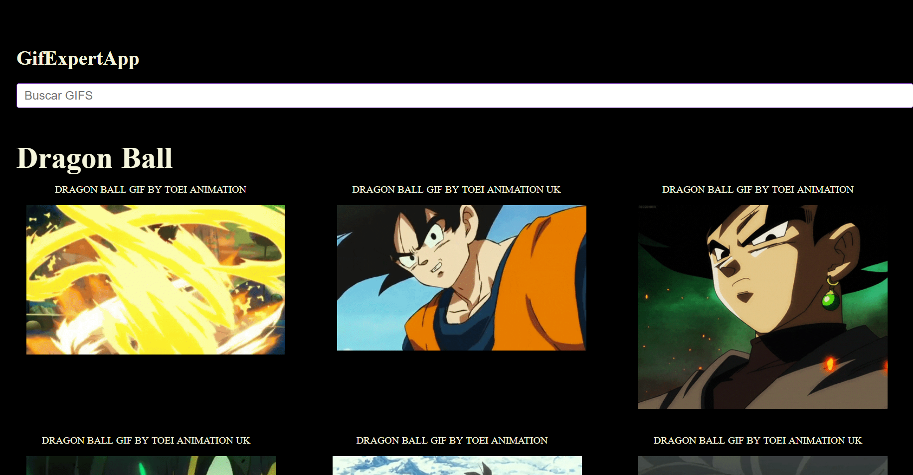

## <h1 align="center">⚡ GIF-Expert-App</h1> 

Ejercitación de consumo de una de las API más conocidas y utilizadas de GIFs por las redes sociales más populares.
 

## 💟 Preview
  

   
  

## 💻 Tecnologías Utilizadas 

## 🌼 URL 

Para interactuar con la plataforma web por favor accede a: <a href="https://gif-expert-app-bresse.netlify.app/" target="_blank">GIF-Expert-App</a>

## 🛠 Cómo usar
Es bastante simple, ya que me encontraba practicando el consumo de API pero sobre todo la creación de componentes y Hooks de REACT. 
Al escribir en el input una palabra y darle enter. devuelve 20 GIFs relacionados a lo solicitado. 
Esta es una de las ejercitaciones que se encuentran en el Curso que estoy realizando de Fernando Herrera - React, de cero a experto ( Hooks y MERN ) 

## ⚙ API Utilizada
https://giphy.com/

## Estado del Proyecto
 En Desarrollo.
 Sé que podría estéticamente pulirla mucho más, pero no es en lo que me concentro actualmente en cuestión de aprendizaje.

